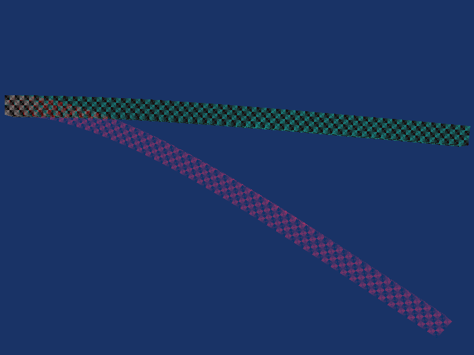

# Enhanced version of coupled FEM and constrained rigid body simulation

## Description
This little playground aimed to test our Conjugate Gradients based MLCP solver versus some other types of solvers (at the moment, conventional Projected Gauss Seidel, and its modification that changes constraint order), as well as some hacks that improve joints stiffness - for example local mass scaling.

The simulation framework capabilities:
1. Old-fashioned linearized dynamics, meaning:
    * calculates constraint properties, such as effective mass, correction parameters, etc - twice per timestep, first time frictionless solve to estimate normal force, second time - full solve with friction limits; both solves use same MLCP solver;
    * uses canonical matrix form with decomposition (`[J]*[M]^-1*[J]^T + [D]`), and not applied form like Sequential/Split Impulses - to facilitate custom solvers implementation.
1. MLCP solvers: **PGS**, **shuffled PGS** (shuffle types: random, forward/backward, leapfrog), **CG-based**.
1. Local mass scaling (see below).
1. Gyroscopic forces effect calculation - better handling of rotating oblong objects, enabling Dzhanibekov effect.
1. Coupled rigid body and corotational FEM-based deformables simulation (see below).
1. General convex collision detection, convex hull represented via support mapping, Minkowski Portal Refinement is used to calculate contact normal.
1. Several basic joint types (ball joint, slider, fixed rotation, limits/motors, etc.).
1. Composite bodies with mass properties calculation.
1. Baumgarte correction (no pseudo-velocities or nonlinear correction) and regularization (a.k.a. constraint force mixing)

The framework is more of a research framework than physics engine ready for release, it requires quite some work to reach the product-eligible state: island detection, sleeping, to name a few. Additionally, data layout is not the most cache-friendly.

## Local mass scaling
Technique, similar to shock propagation - allows to set mass scaling per joint (per constraint row, to be precise); by making joints in an open loop system (such as ragdoll, or a tree) scale masses higher for bodies closer to root - one could improve system stability and stiffness. Similarly, there is n option to scale masses for contact joints, based on their relative positions in the gravity field. It is still a hack however, so artifacts could arise; one example is stack being too stable and resisting tumbling, but the effect is barely noticeable if mass scaling is low (around 2.0 total).

## Preconditioned Conjugate Gradients MLCP solver
Port from an earlier research collaboration (available [on github](https://github.com/avoroshilov/physics_fem_rbd) as well). Since it was developed to solve MLCPs - supports contacts with friction pyramid, limits, constraint forces boundaries, etc. Preconditioned using double-Jacobi preconditioner to maintain desired matrix properties. Solver that has better convergence characteristics than conventional Projected Gauss-Seidel.

**Pros**:
* Significantly better convergence characteristics
* Naturally parallel (as opposed to sequential PGS), not requiring colorizing or splitting to utilize highly-parallel HW (e.g. GPUs)

**Cons**:
* Requires spectral radius calculation (estimated using several Power Iterations, each iteration is also inherently parallel)
* Provides noisy solution on low iteration count
* One iteration is more expensive than one iteration of PGS

These properties make it worse candidate than PGS for game-like scenarios when accuracy is not important, but much better candidate when joint stiffness is required, or just for very complex systems.

Details of the maths behind the solver design available in the [project paper](https://github.com/avoroshilov/physics_fem_rbd/raw/master/materials/fem_paper.pdf).

Example convergence of conventional PGS vs our CG-based MLCP solver - stiff FEM rod, made of `(48x2x1)*5=480` FEM tetrahedra, making total `2880` constraint rows. The amount of iterations is not equal, but set so that the total frametime is equal (16ms on ultrabook Core i7-6500U). Red is PGS 157 iterations, and Cyan is LCPCG 75 iterations (plus 15 iterations overhead for Power Iteration).



This scene clearly shows advantage of CG-based solver in relatively complex systems.

## FEM-based deformables w/ coupling
As the PCG-based MLCP solver described above, port of the [earlier research collaboration](https://github.com/avoroshilov/physics_fem_rbd), which formulates corotational FEM joints, that connects 4 linear nodes (mass points), thus allowing the deformable bodies to be part of a single system with rigid bodies, and providing natural two-way coupling. Additional ball joint that connects rigid body and FE face (3 linear nodes) is implemented.

Details of the approach are also described in the [project paper](https://github.com/avoroshilov/physics_fem_rbd/raw/master/materials/fem_paper.pdf).

## Build/run
The sample uses Vulkan graphics API, and one needs to perform following steps in order to build and run the sample:
1. Download and install [LunarG Vulkan SDK](https://vulkan.lunarg.com/sdk/home) (for the reference, the framework uses 1.0.61.1, but any recent should do);
2. Update `vkEngine\PropertySheet.props` to contain correct SDK installation path, like this:
    ```
    <VulkanSDKRoot>d:\Program Files\VulkanSDK\1.0.61.1</VulkanSDKRoot>
    ```
3. Run `vkEngine.sln` and build as usual.

## Controls:
* `WASD`+`PgDn`/`PgUp`+mouse - control camera, use `[shift]` to move faster and `[ctrl]` to move slower
* `q` to pause/unpause
* `p` to perform a single step
* `e` to throw a box
* right mouse button to switch mouse modes (default is camera control mode, alternative is picking mode - use LMB to pick bodies when in alternative mouse mode)

## License
[Creative Commons Attribution-NonCommercial-ShareAlike 4.0 International Public License](https://creativecommons.org/licenses/by-nc-sa/4.0/legalcode)
